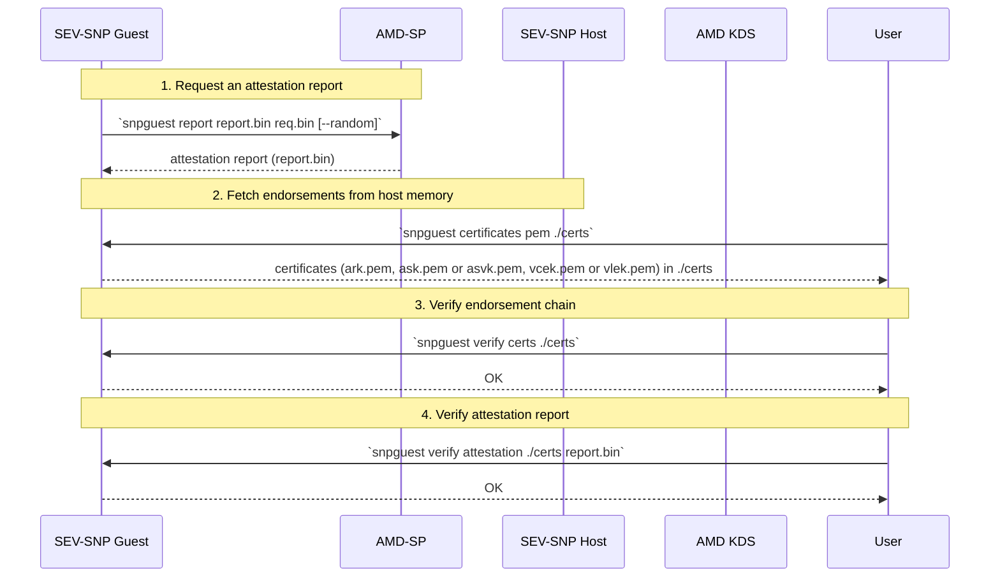

# Extended Attestation Workflow using snpguest

This workflow shows how to perform **Extended Attestation**, where all endorsements (certificate chain and CRL) are retrieved directly from the host’s extended memory and used to verify an attestation report.



## Steps

> **Note:** In this simplified workflow, all steps (including certificate chain and report verification) are executed on the Guest OS for demonstration purposes. In production, the verification steps must be performed on the trusted environment (s.g. the relying party's machine or the trusted verifier).

### 1. Obtain an attestation report

```bash
snpguest report report.bin request-data.bin --random
```

Retrieves a report from the host firmware (or vTPM) and writes it to `report.bin`.

### 2. Fetch endorsements from host extended memory

```bash
snpguest certificates pem ./certs
```

This command reads all certificates from hypervisor's memory.

**Note**: On some SEV-SNP CVM platforms, only the leaf certificate is exposed:
- **Google Cloud SEV-SNP CVM** caches the full VCEK chain in extended memory.  
- **AWS SEV-SNP CVM** caches only the VLEK certificate. In that case, fetch the missing ARK/ASVK certificates from AMD KDS:
   ```bash
   snpguest fetch ca pem ./certs -r report.bin
   ```

### 3. Verify the certificate chain

```bash
snpguest verify certs ./certs
```

Verifies the certificate chain ARK → ASK/ASVK → VCEK/VLEK.

### 4. Verify the attestation report

```bash
snpguest verify attestation ./certs report.bin
```

Performs TCB and signature verification against the fetched certificate.
