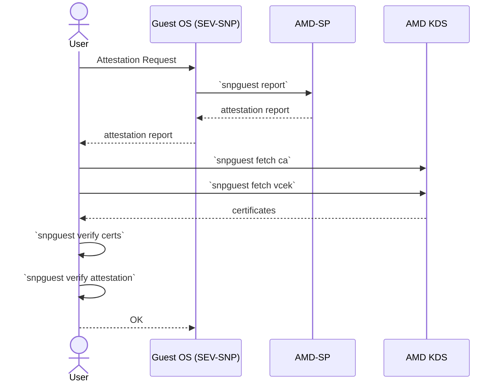

# Regular Attestation Workflow using snpguest

This workflow shows how to perform **Regular Attestation**, where certificates (ARK, ASK/ASVK, VCEK/VLEK) are fetched from the AMD Key Distribution Service (KDS) and used to verify an attestation report.



## Steps

> **Note:** In this tutorial, all steps (including certificate chain and report verification) are executed on the Guest OS for demonstration purposes. In production, a Relying Party or trusted verifier outside the guest should perform these verification steps to maintain proper trust boundaries.

### 1. Request an attestation report

```bash
snpguest report report.bin req.bin --random
```

Generates a request file (64 bytes) and retrieves an attestation report from the AMD-SP.

### 2. **Fetch endorsements from AMD KDS**

Root CA and intermediate CA (ARK + ASK):

```bash
snpguest fetch ca <encoding> <certs_dir> <processor_model> --endorser vcek
```

Leaf certificate (VCEK):

```bash
snpguest fetch vcek <encoding> <certs_dir> report.bin [--processor-model <model>]
```

Certificate Revocation List (CRL):
```bash
snpguest fetch crl <encoding> <certs_dir> <processor_model> --endorser vcek
```

### 3. Verify the certificate chain

```bash
snpguest verify certs ./certs
```

Ensures ARK→ASK/ASVK→VCEK/VLEK chain is valid and checks CRL if provided.

### 4. **Verify the attestation report**

```bash
snpguest verify attestation ./certs report.bin
```

Performs TCB and signature verification against the fetched endorsements.

